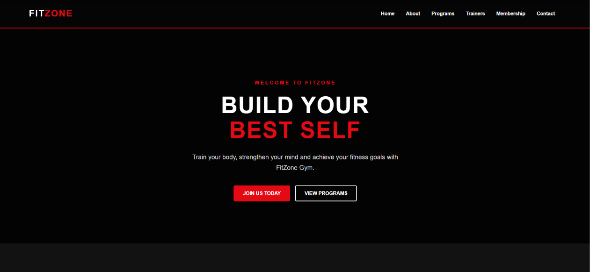
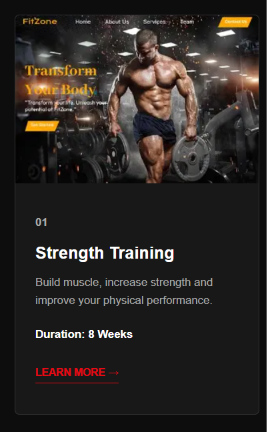
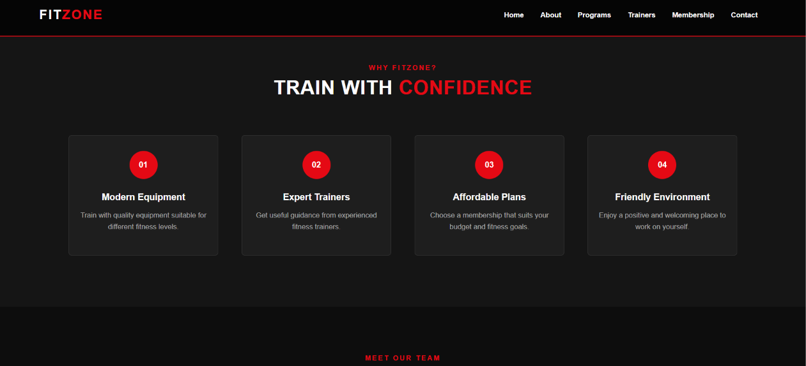

# Project README

## 1. Student Information

- **Name:** BIBASH KUMAL
- **Student ID:** 2610412550
- **Course:** BSc(Hons) Software Engineer
- **College:** Patan College for Professional Studies(PCPS)
- **Date:** 6th October 2026

---

## 2. Project Description

This project was created as part of my academic coursework. The main purpose of this project is to apply the concepts and skills learned during the course and build a functional project using appropriate technologies.

The project demonstrates my understanding of programming concepts, project development, problem-solving, and practical implementation.

---

## 3. Technologies

The following technologies were used in this project:

- HTML
- CSS
- Git & GitHub
- Visual Studio Code

> Add or remove technologies according to the technologies actually used in your project.

---

## 4. Learning Resources

I used the following resources to learn and complete the project:

- Class notes and lectures
- MDN Web Docs
- W3Schools
- YouTube tutorials
- GitHub documentation
- Stack Overflow

---

## 5. What I Learned

Through this project, I learned:

- How to structure a project properly
- How to write and organize code
- How to use Git and GitHub
- How to debug errors
- How to solve programming problems
- How to build and test a project
- How to document a project using a README file

---

## 6. Screenshots

### Navigation Bar

### Single Card

### Multiple Card

### Complete Project Page

> Replace the image paths above with your actual screenshots.

---

## 7. Challenges and Solutions

### Challenge 1: Debugging Errors

I faced some errors while developing the project. I solved them by checking the error messages, reviewing my code, and using online documentation.

### Challenge 2: Understanding New Concepts

Some concepts were difficult to understand initially. I used class materials, tutorials, and documentation to improve my understanding.

### Challenge 3: Project Organization

Managing different files and keeping the project organized was challenging. I solved this by separating files according to their purpose and maintaining a clear folder structure.

---

## 8. AI Usage

AI tools were used as a learning and development assistant during this project.

AI was used for:

- Understanding programming concepts
- Debugging and explaining errors
- Getting suggestions for code improvements
- Improving project documentation
- Learning best practices

The final implementation was reviewed and modified by me to understand how the code works.

---

## 9. Conclusion

This project helped me improve my technical knowledge and practical programming skills. I gained experience in developing a project, solving problems, debugging code, and documenting my work properly.

